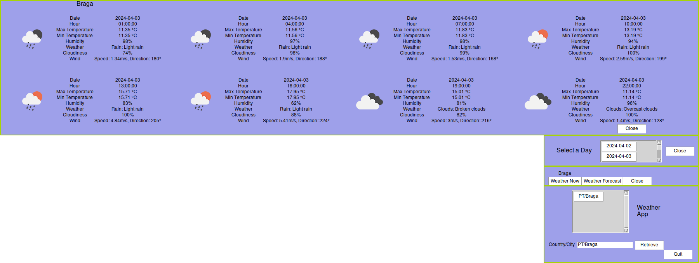

# Weather App

## Description

This is a simple weather application that retrieves weather information for a given city using the OpenWeatherMap API. It allows users to view current weather conditions and a 5-day weather forecast.

## Installation

1. Clone the repository to your local machine:

    ```bash
    git clone https://github.com/mArcio-Lmano/weather-app.git
    ```

2. Navigate to the project directory:

    ```bash
    cd WeatherApp 
    ```
3. Create a virtual environment (optional but recommended):

    ```bash
    python3 -m venv venv
    ```
4. Activate the virtual environment:
    
    4.1. On Windows
    ```powershell
    venv\Scripts\activate
    ```

    4.2 On macOS and Linux:
    ```bash
    source venv/bin/activate
    ```

5. Install the required dependencies:

    ```bash
    pip install -r requirements.txt
    ```

6. Obtain an API key from OpenWeatherMap and save it in a file named api.key in the project directory.

## Usage

Run the main.py script to start the application (inside the ```src/``` file:

```bash
python main.py
```

Once the application is running, you can enter the desired country code/city in the input field and click on the "Retrieve" button to fetch weather information.


**Disclaimer:** This application was developed with a particular window manager, called XMonad, in mind, and optimized for a 1080p monitor. Therefore, its layout may appear unusual on other setups.

The follwing setting were added to the xmonad config file ```xmonad.hs```:

```haskel
ManageHook = composeAll
    [ 
        ...
    , className =? "Tk"             --> doFloat
    , className =? "Toplevel"       --> doFloat
        ...]
```

## Images


